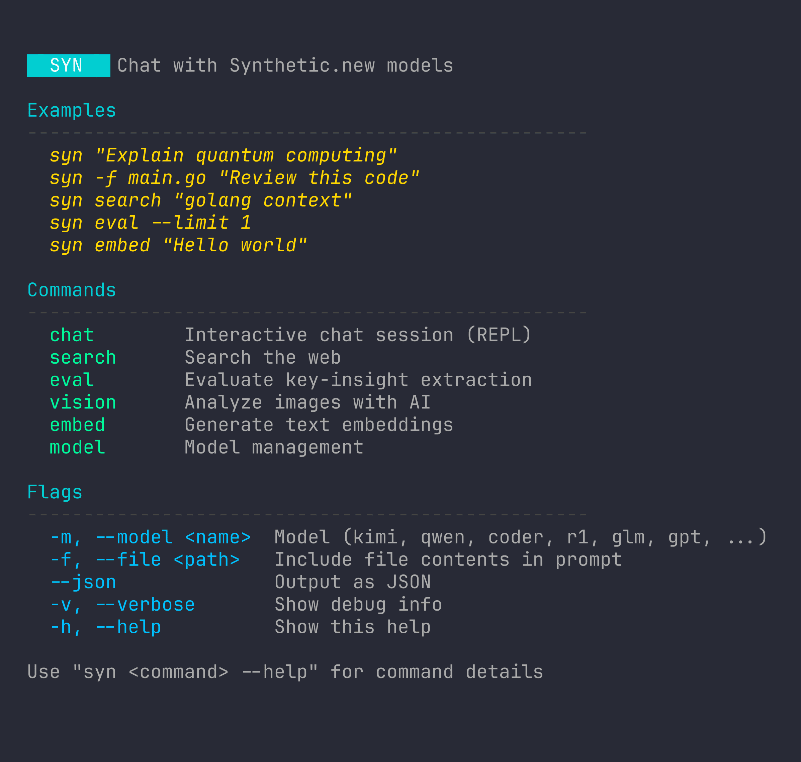

# syn

CLI for [Synthetic.new](https://synthetic.new) AI API.

## Install

```bash
go install github.com/dotcommander/syn@latest
```

## Setup

```bash
export SYN_API_KEY="your-api-key"
```

Or create `~/.config/syn/config.yaml`:

```yaml
api:
  key: "your-api-key"
  model: "hf:deepseek-ai/DeepSeek-V3.2"
```

## Usage



### Chat

```bash
# One-shot
syn "Explain goroutines"

# With file context
syn -f main.go "Review this code"

# Pipe input
pbpaste | syn "Summarize this"
cat error.log | syn "What went wrong?"

# Select model
syn -m kimi "Complex reasoning task"
syn -m qwen "Describe this architecture"

# JSON output
syn --json "List 3 facts about Go"
```

### Interactive REPL

```bash
syn chat
```

Commands: `/help`, `/clear`, `/model`, `/context`, `/exit`

### Web Search

```bash
syn search "golang error handling best practices"
syn search --json "react server components"
```

### Vision

```bash
syn vision screenshot.png "What's in this image?"
syn vision https://example.com/diagram.png "Explain this diagram"
```

### Embeddings

```bash
syn embed "Hello world"
syn embed "Text 1" "Text 2" "Text 3"
syn embed --json "For vector storage"
```

### Models

```bash
syn model list
```

### Evaluation

```bash
# Run insight-extraction eval across all listed models
syn eval --dataset testdata/eval/walter_lewin

# Save machine-readable report
syn eval --format json --out analysis-results/eval-report.json

# Evaluate only selected models
syn eval --models "hf:deepseek-ai/DeepSeek-V3.2,hf:moonshotai/Kimi-K2-Thinking"

# Keep persistent score history + leaderboard
syn eval --history analysis-results/eval-history.jsonl --leaderboard-out analysis-results/eval-leaderboard.md
```

## Model Aliases

| Alias | Model |
|-------|-------|
| `kimi` | Kimi-K2-Thinking |
| `qwen` | Qwen3-VL-235B (vision) |
| `glm` | GLM-4.7 |
| `gpt` | GPT-OSS-120B |
| `deepseek` | DeepSeek-V3.2 (default) |

## Flags

| Flag | Description |
|------|-------------|
| `-m, --model` | Model name or alias |
| `-f, --file` | Include file in prompt |
| `--json` | JSON output |
| `-v, --verbose` | Debug output |

## Contributing

Contributions are welcome! Please follow these guidelines:

### Development Setup

1. **Fork and clone the repository:**

   ```bash
   git clone https://github.com/YOUR_USERNAME/syn.git
   cd syn
   ```

2. **Install dependencies:**

   ```bash
   go mod download
   ```

3. **Build the project:**

   ```bash
   go build -o syn
   ```

4. **Run tests:**

   ```bash
   go test ./...
   ```

### Submitting Changes

1. **Create a branch** from `main`
2. **Make your changes** following Go best practices
3. **Write/update tests** for your changes
4. **Ensure all tests pass:** `go test ./...`
5. **Update documentation** if needed
6. **Commit** with clear messages using conventional commit format:

   ```
   type(scope): description

   feat: New feature
   fix: Bug fix
   docs: Documentation changes
   test: Test additions or changes
   refactor: Code refactoring
   chore: Maintenance tasks
   ```

7. **Push to your fork** and submit a pull request

### Code of Conduct

- Be respectful and inclusive
- Provide constructive feedback
- Focus on what is best for the community
- Show empathy towards other community members

For detailed API documentation, see [docs/API.md](docs/API.md).

## License

MIT
